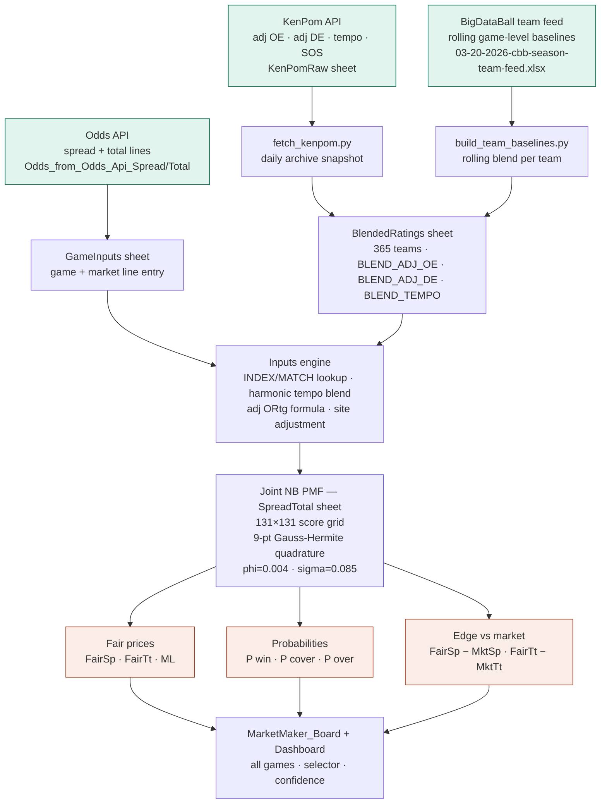

# Excel & Python NCAAB Predictive & Pricing Model
## Phase 1 — Pregame Market Pricing Engine

**Author:** Joseph Shackelford, ASA MAAA  
**Stack:** Python 3.9 · KenPom API · BigDataBall · openpyxl · scikit-learn · Excel/VBA  
**Status:** Phase 1 complete — research pricing workbook / provisional production candidate  
**Phase 2:** Market-relative residual model (in development)

---

## What this is

A structured pregame pricing engine for NCAA men's basketball that generates fair spreads, fair totals, and moneyline probabilities from a joint Negative Binomial PMF framework. The model integrates rolling BigDataBall team baselines with date-stamped KenPom efficiency priors, applies walk-forward Platt and isotonic calibration, and delivers trader-facing output through a live Excel workbook with full formulas.

The goal was not just to build a model — it was to build something auditable: a system where every number on the dashboard can be traced back to a specific formula, a specific data source, and a specific design decision.

---

## Pipeline



---

## Blend formula (P2_30)

The `BlendedRatings` sheet holds one row per team. The Python pipeline writes pre-computed blend values that the Excel formulas then consume via `INDEX/MATCH`.

```
BLEND_ADJ_OE  = KP_AdjOE  × 0.70  +  BDB_rolling_OE    × 0.30
BLEND_ADJ_DE  = KP_AdjDE  × 0.70  +  BDB_rolling_DE    × 0.30
BLEND_TEMPO   = KP_Tempo  × 0.80  +  BDB_rolling_Tempo × 0.20
```

The `Inputs` sheet then computes expected scoring efficiency per matchup:

```
Exp_Home_ORtg = LeagueAvg_OE
              + 0.55 × (Home_BLEND_ADJ_OE − LeagueAvg_OE)
              + 0.45 × (LeagueAvg_DE      − Away_BLEND_ADJ_DE)

Pace = 0.85 × harmonic_mean(Home_Tempo, Away_Tempo)
     + 0.15 × KP_league_avg_tempo
```

---

## File manifest

### Excel workbooks
| File | Purpose |
|---|---|
| `ncaab_marketmaker_PMF_pricing_model_2026-03-19_WORKING.xlsm` | Live model — all formulas, PMF engine, dashboard, game selector |
| `ncaab_market_maker_2026-03-23_PRODUCTION.xlsx` | Audited calibrated output — 2026-03-23 Sweet 16 slate |

### Python scripts — core pipeline
| Script | Purpose |
|---|---|
| `fetch_kenpom.py` | Pulls KenPom ratings + four factors via API, saves daily archive |
| `build_team_baselines.py` | Builds rolling BDB pregame baselines per team from season feed |
| `extract_schedule_from_workbook_two_tabs.py` | Extracts game slate from `.xlsm` into `GameInputs.csv` |
| `run_phase3a1_production.py` | Prices all slate games — team-only P2_30 model |
| `build_historical_predictions.py` | Walk-forward historical calibration — Platt ML, isotonic ATS/TOT |
| `build_calibrated_workbook_final.py` | Builds the audited production `.xlsx` workbook |

### Python scripts — validation
| Script | Purpose |
|---|---|
| `run_full_audit.py` | Verifies Model_Info fields and column presence in production workbook |
| `run_subset_diagnostics.py` | ATS/TOT subset signal analysis + totals edge-bucket table |
| `run_min_games_ablation.py` | Tests `min_games` parameter across 0/3/5/10 settings |

### Experimental (not in production)
| Script | Purpose |
|---|---|
| `build_player_adjustments.py` | Player residual layer — failed holdout, stays experimental |
| `build_historical_player_predictions.py` | Historical backtest of player layer — produced the failure diagnosis |

### Cache and data (not committed — too large)
| Path | Contents |
|---|---|
| `cbb_cache/KenPom_Archive_YYYY-MM-DD.csv` | 136 daily KenPom snapshots, Nov 2025 – Mar 2026 |
| `cbb_cache/TeamBaselines.csv` | 11,946 rows of rolling BDB pregame baselines |
| `cbb_cache/historical_p230_predictions.csv` | 906-game holdout prediction set |
| `feeds_daily/` | BDB season team and player feeds |

---

## Validation results (Phase 1 holdout)

906 games · 728 H/R · 178 neutral · KenPom coverage 99.8% · BDB fallback 0.2%

| Market | N | AUC raw | AUC cal | Brier raw | Brier cal | Method |
|---|---|---|---|---|---|---|
| ML | 728 | 0.7785 | 0.7799 | 0.1950 | 0.1866 | Platt logistic |
| ATS | 728 | 0.5127 | 0.4967 | 0.2572 | 0.2532 | Isotonic OOF |
| TOT | 728 | 0.5157 | 0.4960 | 0.2550 | 0.2528 | Isotonic OOF |

**ATS edge buckets (H/R, side-aware, breakeven 52.38%):**

| Bucket | N | Cover% | EV@−110 | Beats vig | N≥150 |
|---|---|---|---|---|---|
| 0–1.5 | 192 | 49.0% | −0.065 | No | Yes |
| 1.5–3 | 197 | 46.2% | −0.118 | No | Yes |
| 3–5 | 207 | 52.7% | +0.005 | **Yes** | **Yes** |
| >5 | 132 | 56.1% | +0.070 | **Yes** | No |

**Totals edge buckets (|FairTt − MktTt|):**

| Bucket | N | Over% | EV@−110 | Beats vig | N≥150 |
|---|---|---|---|---|---|
| 0–2 | 272 | 43.8% | −0.165 | No | Yes |
| 2–4 | 225 | 53.3% | +0.018 | **Yes** | **Yes** |
| 4–6 | 116 | 55.2% | +0.053 | Yes | No |
| >6 | 115 | 52.2% | −0.004 | No | No |

---

## What worked

- Full PMF architecture with exact joint grid — internally consistent fair prices across spread, total, and ML from a single probability mass
- KenPom + BDB blend with 136 date-stamped archives, 99.8% historical KenPom-at-date coverage, zero BDB fallback on final run
- Platt calibration reduced ML log-loss from 0.5755 → 0.5511 and slope from 1.581 → 1.029
- Hard production/experimental separation with filename safeguard — player-adjusted latents cannot be written to a file labeled PRODUCTION
- ATS 3–5 edge bucket shows positive EV at N=207, the only N≥150 bucket beating vig

## What failed

- **Player residual layer:** Too aggressive — 53% of historical games moved ≥2 points. All holdout ATS buckets went negative EV. Root cause: 5-game recent window vs. season baseline is too noisy for a production-grade residual. Kept in experimental workbook only.
- **ATS/TOT overall signal weak:** AUC ~0.51 across all H/R subsets. Not concentrated in higher-quality data subsets — all cuts returned identical results, meaning data quality is not the bottleneck.
- **Sample size:** 906 games is too small for stable bucket-level conclusions. Phase 2 will expand to multiple prior seasons.

## What I would build next (Phase 2)

1. **Market-relative residual model** — target `actual_margin − market_spread` directly, not `P(cover)`. Features: FairSp−MktSp, FairTt−MktTt, KenPom O/D gaps, pace mismatch, neutral flag, rest days
2. **Separate totals track** — dedicated possessions model with its own calibration
3. **Larger historical sample** — 2–3 prior seasons of BDB + KenPom
4. **Rearchitected player layer** — position-weighted PPP, minimum 7-game window, injury flags, ±2pt clip maximum
5. **Recalibration** — only after raw signal improves, not before

---

## Product classification

**Research pricing workbook / provisional production candidate**

This is not a proven market-beating model. It is an auditable pregame pricing engine that prices games correctly from real inputs, separates experimental from production layers, and reports validation results honestly. The ATS and totals signal is weak in aggregate. Two ATS buckets show positive EV but sample sizes are not sufficient for confident live application.

Appropriate uses: line comparison, market intuition, pricing research, trader-facing reference.  
Not appropriate for: live wagering or any claim of proven edge.

---

## Daily workflow

```bash
# 1. Fetch fresh KenPom ratings
python3 fetch_kenpom.py --key YOUR_KEY

# 2. Enter today's games into the .xlsm, save it

# 3. Extract the slate
python3 extract_schedule_from_workbook_two_tabs.py \
    --workbook "./ncaab_marketmaker_PMF_pricing_model_2026-03-19_WORKING.xlsm" \
    --date "YYYY-MM-DD"

# 4. Set neutral site for tournament games
python3 -c "import pandas as pd; df=pd.read_csv('cbb_cache/GameInputs.csv'); df['Site']='N'; df.to_csv('cbb_cache/GameInputs.csv',index=False)"

# 5. Price the slate
python3 run_phase3a1_production.py \
    --slate cbb_cache/GameInputs.csv \
    --baselines cbb_cache/TeamBaselines.csv \
    --kenpom cbb_cache/KenPom_Ratings_2026.csv \
    --kenpom-ff cbb_cache/KenPom_FourFactors_2026.csv \
    --output cbb_cache/MatchupLatents_today_teamonly.csv \
    --date YYYY-MM-DD

# 6. Build the production workbook
python3 build_calibrated_workbook_final.py \
    --latents cbb_cache/MatchupLatents_today_teamonly.csv \
    --cal-report cbb_cache/model_calibration_report.csv \
    --edge cbb_cache/edge_bucket_table.csv \
    --pred cbb_cache/historical_p230_predictions.csv \
    --out "outputs/ncaab_market_maker_YYYY-MM-DD_PRODUCTION.xlsx" \
    --date YYYY-MM-DD
```
